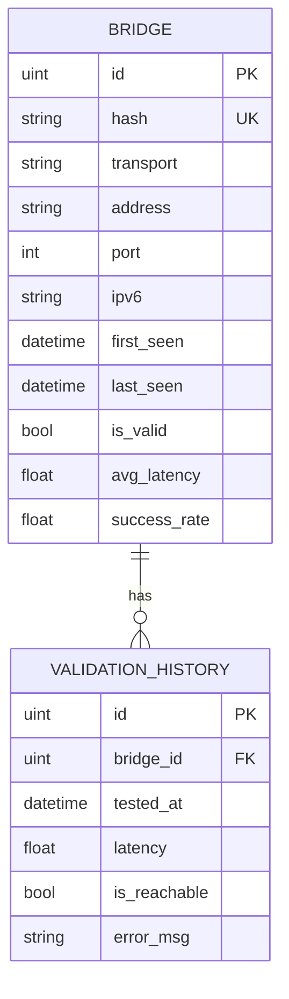
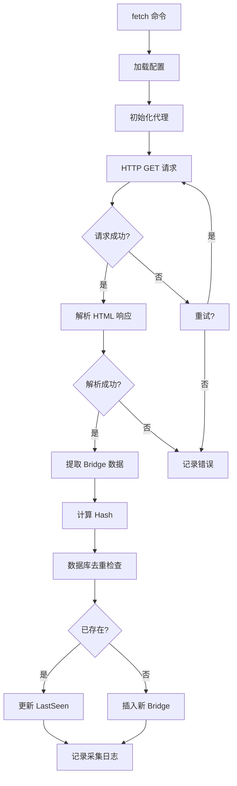
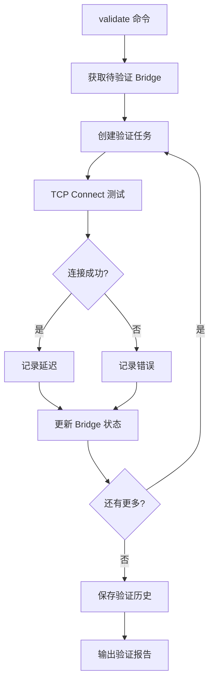

# 技术设计方案

需求名称：tor-bridge-collector
更新日期：2026-03-29

## 1. 概述

### 1.1 项目背景

本项目旨在开发一个 Tor Bridge 数据采集工具，用于从 Tor Project 官方渠道获取 webtunnel bridge 信息，并提供有效性验证、数据持久化、统计分析和 Web UI 功能。

### 1.2 核心功能需求

| 功能 | 描述 |
|------|------|
| 数据采集 | 从 `https://bridges.torproject.org/bridges?transport=webtunnel` 获取 webtunnel 信息 |
| 代理支持 | 支持 HTTP/HTTPS/SOCKS5 代理服务器 |
| 数据持久化 | SQLite 存储历史记录，支持去重和历史追溯 |
| 有效性验证 | TCP 连接测试，记录响应速度 |
| 统计分析 | 实时统计 + 历史聚合分析 |
| 多种输出 | 标准 torrc 格式、JSON、分类文件输出 |
| 初始化 | 在当前目录创建配置文件和数据库文件 |
| 国际化 | 中英文双语界面 (CLI + Web UI) |
| 语言 | Golang |
| 数据库 | SQLite |

### 1.3 交付物清单

- 可执行二进制文件 (linux amd64/arm64, windows amd64, darwin amd64/arm64)
- 全生命周期软件开发文档

---

## 2. 架构设计

### 2.1 技术栈

```
┌─────────────────────────────────────────────────────────────┐
│                      CLI Layer                              │
│                   (Cobra + Viper)                           │
├─────────────────────────────────────────────────────────────┤
│                    Web UI Layer                              │
│                   (Gin + Vanilla JS)                        │
├─────────────────────────────────────────────────────────────┤
│                    Core Modules                              │
│  ┌──────────┐  ┌──────────┐  ┌──────────┐  ┌─────────┐    │
│  │ Fetcher  │  │ Validator│  │ Storage  │  │ Exporter│    │
│  └──────────┘  └──────────┘  └──────────┘  └─────────┘    │
├─────────────────────────────────────────────────────────────┤
│                    Data Layer                               │
│                   (SQLite + gorm)                           │
└─────────────────────────────────────────────────────────────┘
```

### 2.2 模块划分

| 模块 | 职责 | 依赖 |
|------|------|------|
| `cmd` | CLI 命令行入口，命令注册 | cobra |
| `internal/fetcher` | Bridge 数据采集，HTML 解析 | net/http, golang.org/x/net/html |
| `internal/validator` | TCP 连接测试，并发验证 | net |
| `internal/storage` | SQLite 数据持久化 | gorm, sqlite3 |
| `internal/exporter` | 多格式数据导出 | - |
| `internal/i18n` | 国际化支持 | github.com/nicksnyder/go-i18n |
| `internal/proxy` | 代理服务器支持 | golang.org/x/net/proxy |
| `internal/web` | Web UI 服务 | gin |
| `internal/config` | 配置管理 | viper |

---

## 3. 数据模型

### 3.1 ER 图



### 3.2 Bridge 实体

```go
type Bridge struct {
    ID           uint      `gorm:"primaryKey"`
    Hash         string    `gorm:"uniqueIndex;size:64"`      // Bridge 唯一标识 (SHA256)
    Transport    string    `gorm:"size:32"`                 // 传输类型: webtunnel
    Address      string    `gorm:"size:256"`                 // Bridge IP 或域名
    Port         int       `gorm:"port"`                    // 端口
    IPv6         string    `gorm:"size:64"`                 // IPv6 地址 (可选)
    Extort       string    `gorm:"size:512"`                 // 扩展信息 (JSON)
    FirstSeen    time.Time `gorm:"first_seen"`              // 首次发现时间
    LastSeen     time.Time `gorm:"last_seen"`               // 最后发现时间
    IsValid      bool      `gorm:"is_valid;default:false"`  // 是否有效
    AvgLatency   float64   `gorm:"avg_latency;default:0"`  // 平均延迟 (ms)
    SuccessRate  float64   `gorm:"success_rate;default:0"` // 成功率 0-100%
    CreatedAt    time.Time
    UpdatedAt    time.Time
}
```

### 3.3 ValidationHistory 表

```go
type ValidationHistory struct {
    ID          uint      `gorm:"primaryKey"`
    BridgeID    uint      `gorm:"index"`
    Bridge      Bridge    `gorm:"foreignKey:BridgeID"`
    TestedAt    time.Time `gorm:"tested_at"`               // 测试时间
    Latency     float64   `gorm:"latency"`                 // 响应延迟 (ms)
    IsReachable bool      `gorm:"is_reachable"`           // 是否可达
    ErrorMsg    string    `gorm:"size:512"`               // 错误信息
    CreatedAt   time.Time
}
```

---

## 4. 组件与接口

### 4.1 CLI 命令

| 命令 | 功能 | 参数 |
|------|------|------|
| `init` | 初始化配置文件和数据库 | `--force` 强制覆盖 |
| `fetch` | 采集 bridge 数据 | `--proxy` 指定代理 |
| `validate` | 验证 bridge 有效性 | `--all` 验证全部, `--id` 验证指定 |
| `export` | 导出 bridge 数据 | `--format` torrc/json/csv |
| `stats` | 显示统计信息 | `--period` 时间范围 |
| `serve` | 启动 Web UI | `--port` 端口, `--bind` 绑定地址 |

### 4.2 Web UI API

| 方法 | 路径 | 功能 |
|------|------|------|
| GET | `/api/bridges` | 获取 bridge 列表 |
| GET | `/api/bridges/:id` | 获取单个 bridge |
| GET | `/api/bridges/:id/history` | 获取验证历史 |
| GET | `/api/stats` | 获取统计信息 |
| POST | `/api/bridges/:id/validate` | 触发验证 |
| POST | `/api/export` | 导出数据 |
| GET | `/health` | 健康检查 |

### 4.3 配置文件结构

```yaml
# config.yaml
app:
  language: "en"              # en/zh
  db_path: "./data/bridges.db"
  log_level: "info"          # debug/info/warn/error
  log_file: "./logs/app.log"

server:
  host: "0.0.0.0"
  port: 8080

proxy:
  enabled: false
  type: "http"                # http/https/socks5
  address: ""
  port: 0
  username: ""
  password: ""

fetch:
  url: "https://bridges.torproject.org/bridges?transport=webtunnel"
  interval: 3600              # 采集间隔 (秒)
  timeout: 30                # 请求超时 (秒)

validation:
  timeout: 10                # 验证超时 (秒)
  concurrency: 5             # 并发验证数
  retry: 2                    # 重试次数

export:
  torrc_path: "./output/bridges.txt"
  json_path: "./output/bridges.json"
  csv_path: "./output/bridges.csv"
```

---

## 5. 核心流程

### 5.1 数据采集流程



### 5.2 验证流程



### 5.3 torrc 格式

标准 torrc Bridge 格式：

```
Bridge webtunnel <address>:<port> <hash>
```

示例：

```
Bridge webtunnel 192.0.2.1:443 qDa7fJ3k9xVwPqYz6nB8T4eN5hR2sA1d
Bridge webtunnel tor.example.com:443 qWe9rT5kL2mNpQ3vXyZ7Y6hJ8nM0sD5f
```

---

## 6. Web UI 设计

### 6.1 页面结构

```
/                   # Dashboard - 统计概览
/bridges            # Bridge 列表页
/bridges/:id        # Bridge 详情页
/settings           # 设置页
```

### 6.2 Dashboard 统计

- 总 Bridge 数量
- 有效/无效 Bridge 比例
- 平均响应延迟
- 24小时趋势图
- 最近验证结果

---

## 7. 正确性属性

### 7.1 数据去重

- 使用 `Hash = SHA256(transport + address + port)` 唯一标识 bridge
- 相同 bridge 多次采集时更新 `LastSeen` 和 `UpdatedAt`
- 使用 GORM `FirstOrCreate` 确保去重

### 7.2 历史追溯

- 每次验证结果记录到 `ValidationHistory` 表
- Bridge 关联的验证历史可追溯
- 支持按时间范围查询历史

### 7.3 并发安全

- SQLite 使用 WAL 模式支持并发读
- 写操作使用事务锁
- 验证器使用 worker pool 模式控制并发

---

## 8. 错误处理

| 场景 | 处理策略 |
|------|----------|
| 网络请求失败 | 指数退避重试: 2s → 4s → 8s |
| 代理连接失败 | 跳过当前代理，记录错误，继续 |
| TCP 连接超时 | 标记 `IsReachable=false`，记录超时 |
| 数据库写入失败 | 回滚事务，记录日志，向上传播 |
| HTML 解析失败 | 跳过该条记录，记录警告 |

---

## 9. 测试策略

| 级别 | 范围 | 工具 |
|------|------|------|
| 单元测试 | 各模块核心函数 | Go testing |
| 集成测试 | Fetcher/Validator/Storage | testify |
| API 测试 | Web UI 接口 | httptest |
| E2E 测试 | 完整流程 | golangci-e2e |

### 9.1 覆盖率目标

- 核心模块覆盖率 > 70%
- 关键路径覆盖率 > 90%

---

## 10. 项目结构

```
tor-bridge-collector/
├── cmd/
│   ├── root.go           # 根命令
│   ├── init.go           # init 命令
│   ├── fetch.go          # fetch 命令
│   ├── validate.go       # validate 命令
│   ├── export.go         # export 命令
│   ├── stats.go          # stats 命令
│   └── serve.go          # serve 命令
├── internal/
│   ├── config/           # 配置加载
│   ├── fetcher/          # 数据采集
│   ├── validator/        # 有效性验证
│   ├── storage/          # 数据持久化
│   ├── exporter/         # 数据导出
│   ├── proxy/            # 代理支持
│   ├── i18n/             # 国际化
│   └── web/              # Web UI
│       ├── handler/      # HTTP 处理器
│       ├── static/       # 静态文件
│       └── template/     # HTML 模板
├── pkg/
│   └── models/           # 数据模型
├── locales/              # 翻译文件
│   ├── en.yaml
│   └── zh.yaml
├── migrations/           # 数据库迁移
├── config.yaml           # 配置文件
├── main.go               # 程序入口
├── go.mod
└── README.md
```

---

## 11. 依赖清单

| 依赖 | 版本 | 用途 |
|------|------|------|
| github.com/spf13/cobra | v1.8+ | CLI 框架 |
| github.com/spf13/viper | v1.18+ | 配置管理 |
| gorm.io/gorm | v1.25+ | ORM |
| gorm.io/driver/sqlite | v1.5+ | SQLite 驱动 |
| github.com/gin-gonic/gin | v1.9+ | Web 框架 |
| github.com/nicksnyder/go-i18n | v2+ | 国际化 |
| golang.org/x/net | latest | 网络工具 |
| golang.org/x/net/proxy | latest | SOCKS5 代理 |

---

## 12. 构建与发布

### 12.1 构建矩阵

| 平台 | 架构 | 输出 |
|------|------|------|
| Linux | amd64 | tor-bridge-collector-linux-amd64 |
| Linux | arm64 | tor-bridge-collector-linux-arm64 |
| Windows | amd64 | tor-bridge-collector-windows-amd64.exe |
| Darwin | amd64 | tor-bridge-collector-darwin-amd64 |
| Darwin | arm64 | tor-bridge-collector-darwin-arm64 |

### 12.2 构建命令

```bash
# Linux
GOOS=linux GOARCH=amd64 go build -o tor-bridge-collector-linux-amd64

# Windows
GOOS=windows GOARCH=amd64 go build -o tor-bridge-collector-windows-amd64.exe

# Darwin
GOOS=darwin GOARCH=arm64 go build -o tor-bridge-collector-darwin-arm64
```
