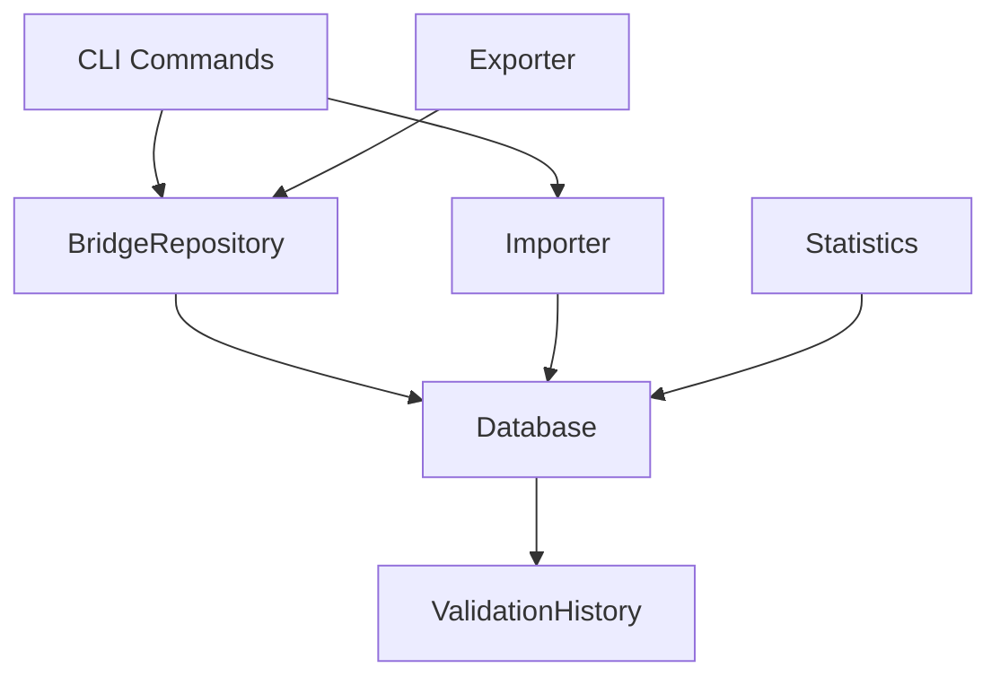
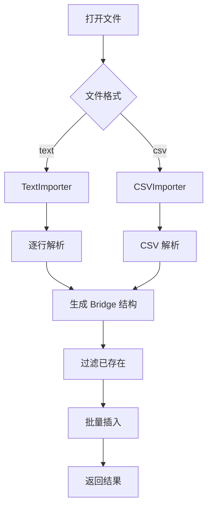

# 改进0330 - Bridge Collector 功能增强技术设计

需求名称：2026-03-30-bridge-collector-enhancement
更新日期：2026-03-30
状态：技术设计

---

## 1. 概述

### 1.1 项目背景

tor-bridge-collector 是一个用于采集、验证和管理 Tor 网桥数据的命令行工具。当前系统支持从 Tor Project 获取网桥、验证可用性、导出配置等功能。

### 1.2 需求概述

本次增强包含三个功能点：
1. **数据库查询导出**：支持按获取次数和验证次数聚合查询筛选网桥
2. **文件导入功能**：支持从 text/csv 文件批量导入网桥
3. **自动化发布**：通过 GitHub Actions 实现打 tag 时自动发布到 Releases

---

## 2. 架构设计

### 2.1 整体架构

```
tor-bridge-collector
├── cmd/server/main.go           # CLI 入口
├── pkg/
│   ├── bridge/
│   │   ├── types.go             # Bridge 数据结构
│   │   ├── fetcher.go           # 数据采集
│   │   └── parser.go            # 数据解析
│   ├── database/
│   │   ├── db.go                # 数据库连接
│   │   ├── bridge_repo.go       # 网桥仓库
│   │   └── history_repo.go      # 历史记录仓库
│   ├── importer/                # [新增] 导入模块
│   │   ├── importer.go         # 导入接口定义
│   │   ├── text_importer.go    # Text 格式导入
│   │   └── csv_importer.go     # CSV 格式导入
│   ├── exporter/
│   │   └── exporter.go          # 导出模块
│   ├── statistics/
│   │   └── realtime.go         # 实时统计
│   └── validator/
│       └── checker.go          # 验证器
├── configs/
│   └── config.go               # 配置管理
├── scripts/
│   └── build.sh                # 构建脚本
└── .github/workflows/
    └── release.yml             # [新增] GitHub Actions 发布流程
```

### 2.2 模块依赖关系



---

## 3. 功能点 1：按获取/验证次数查询导出

### 3.1 设计决策

**统计方式**：每次查询时从 `validation_history` 表聚合计算，不在 `bridges` 表维护计数。

**理由**：
- 避免数据不一致
- 减少数据库写入操作
- validation_history 已记录完整历史

### 3.2 数据模型

#### QueryOption 结构 (pkg/database/bridge_repo.go)

```go
type BridgeQueryOption struct {
    MinFetchCount       int    // 网桥被获取的最小次数（基于发现次数）
    MaxFetchCount       int    // 网桥被获取的最大次数
    MinValidationCount  int    // 最小验证次数（从 history 聚合）
    MinSuccessCount     int    // 最小成功验证次数
    IsAvailable         *bool  // 可用性筛选（nil 表示不筛选）
    OrderBy             string // 排序字段：fetch_count, validation_count, success_rate, last_validated
    OrderDesc           bool   // 是否降序
    Limit               int    // 限制返回数量，0 表示不限制
}
```

#### 聚合查询 SQL

```sql
SELECT 
    b.*,
    COUNT(vh.id) AS validation_count,
    SUM(CASE WHEN vh.is_available = 1 THEN 1 ELSE 0 END) AS success_count,
    MAX(vh.validated_at) AS last_validated_at
FROM bridges b
LEFT JOIN validation_history vh ON b.id = vh.bridge_id
GROUP BY b.id
HAVING validation_count >= ? AND success_count >= ?
ORDER BY success_rate DESC
LIMIT ?
```

### 3.3 新增 Repository 方法

```go
// GetBridgesWithStats 返回网桥及其聚合统计信息
func (r *BridgeRepository) GetBridgesWithStats(opts *BridgeQueryOption) ([]BridgeWithStats, error)

// BridgeWithStats 包含统计信息的网桥结构
type BridgeWithStats struct {
    Bridge
    ValidationCount int
    SuccessCount    int
    SuccessRate     float64
    LastValidatedAt time.Time
}
```

### 3.4 CLI 命令设计

```bash
# 按验证次数查询（最少验证 10 次）
tor-bridge-collector query --min-validation 10

# 按成功次数和成功率查询
tor-bridge-collector query --min-validation 5 --min-success 3

# 导出符合条件的 torrc 文件
tor-bridge-collector query --min-validation 10 --format torrc --output ./filtered

# 导出 JSON 格式并限制数量
tor-bridge-collector query --min-success 5 --limit 100 --format json --output ./output

# 按成功率排序
tor-bridge-collector query --order-by success_rate --order desc --limit 50
```

### 3.5 命令行参数

| 参数 | 说明 | 类型 | 默认值 |
|------|------|------|--------|
| `--min-validation` | 最小验证次数 | int | 0 |
| `--max-validation` | 最大验证次数 | int | 0 |
| `--min-success` | 最小成功次数 | int | 0 |
| `--available` | 只返回可用的 | bool | false |
| `--order-by` | 排序字段 | string | "validation_count" |
| `--order` | 排序方向 (asc/desc) | string | "desc" |
| `--limit` | 返回数量限制 | int | 0 |
| `--format` | 导出格式 (torrc/json/all) | string | "torrc" |
| `--output` | 输出目录 | string | "./output" |

---

## 4. 功能点 2：文件导入功能

### 4.1 设计决策

**导入策略**：只导入新的网桥，基于 hash 去重。

**理由**：
- 避免重复数据
- 不覆盖用户手动编辑的信息
- 保持数据完整性

### 4.2 导入器接口

```go
// Importer 导入器接口
type Importer interface {
    Import(filePath string) ([]bridge.Bridge, error)
    Parse(filePath string) ([]bridge.Bridge, error)
}

// NewImporter 根据文件格式返回对应导入器
func NewImporter(format string) Importer
```

### 4.3 Text 文件导入器

**支持格式**：
- Tor 官方格式：`webtunnel ip:port [fingerprint ...]`
- 简化格式：`ip:port fingerprint`

**实现**：

```go
type TextImporter struct{}

func (t *TextImporter) Parse(filePath string) ([]bridge.Bridge, error) {
    file, err := os.Open(filePath)
    if err != nil {
        return nil, err
    }
    defer file.Close()

    var bridges []bridge.Bridge
    scanner := bufio.NewScanner(file)
    for scanner.Scan() {
        line := scanner.Text()
        if b, err := bridge.ParseBridgeLine(line); err == nil {
            bridges = append(bridges, *b)
        }
    }
    return bridges, scanner.Err()
}
```

### 4.4 CSV 文件导入器

**CSV 格式**：
```csv
transport,address,port,fingerprint
webtunnel,192.168.1.1,443,ABC123...
webtunnel,192.168.1.2,443,DEF456...
```

**实现**：

```go
type CSVImporter struct{}

func (c *CSVImporter) Parse(filePath string) ([]bridge.Bridge, error) {
    file, err := os.Open(filePath)
    if err != nil {
        return nil, err
    }
    defer file.Close()

    reader := csv.NewReader(file)
    records, err := reader.ReadAll()
    if err != nil {
        return nil, err
    }

    var bridges []bridge.Bridge
    for i, record := range records[1:] { // 跳过表头
        if len(record) < 3 {
            continue
        }
        b := bridge.Bridge{
            Transport: record[0],
            Address:   record[1],
            Port:      parsePort(record[2]),
        }
        if len(record) > 3 {
            b.Fingerprint = record[3]
        }
        b.Hash = b.GenerateHash()
        bridges = append(bridges, b)
    }
    return bridges, nil
}
```

### 4.5 导入流程



### 4.6 CLI 命令设计

```bash
# 导入 text 文件
tor-bridge-collector import -f ./bridges.txt

# 导入 CSV 文件
tor-bridge-collector import -f ./bridges.csv --format csv

# 导入并验证
tor-bridge-collector import -f ./bridges.txt --validate

# 指定传输类型（用于无类型的文件）
tor-bridge-collector import -f ./bridges.txt --transport webtunnel
```

### 4.7 命令行参数

| 参数 | 说明 | 类型 | 默认值 |
|------|------|------|--------|
| `-f, --file` | 导入文件路径（必需） | string | - |
| `--format` | 文件格式 (text/csv) | string | "text" |
| `--transport` | 默认传输类型 | string | "webtunnel" |
| `--validate` | 导入后验证 | bool | false |

### 4.8 导入结果输出

```
Import Results:
  Total in file: 100
  Imported: 25
  Skipped (duplicate): 75
  Validation requested: yes
```

---

## 5. 功能点 3：GitHub Releases 自动发布

### 5.1 设计决策

**触发方式**：打 git tag 时自动触发 GitHub Actions。

**发布内容**：
- 多平台二进制文件（Linux/macOS/Windows × amd64/arm64）
- SHA256 checksums 文件
- 详细发布说明

### 5.2 GitHub Actions 工作流

**文件位置**：`.github/workflows/release.yml`

```yaml
name: Release

on:
  push:
    tags:
      - 'v*'

jobs:
  build:
    runs-on: ubuntu-latest
    strategy:
      matrix:
        goos: [linux, darwin, windows]
        goarch: [amd64, arm64]
    steps:
      - uses: actions/checkout@v4
      
      - name: Set up Go
        uses: actions/setup-go@v5
        with:
          go-version: '1.21'
      
      - name: Build
        env:
          GOOS: ${{ matrix.goos }}
          GOARCH: ${{ matrix.goarch }}
        run: |
          OUTPUT_NAME="tor-bridge-collector-${{ matrix.goos }}-${{ matrix.goarch }}"
          [ "${{ matrix.goos }}" = "windows" ] && OUTPUT_NAME="${OUTPUT_NAME}.exe"
          go build -o "./release/${OUTPUT_NAME}" ./cmd/server
      
      - name: Upload artifact
        uses: actions/upload-artifact@v4
        with:
          name: ${{ matrix.goos }}-${{ matrix.goarch }}
          path: ./release/*

  release:
    needs: build
    runs-on: ubuntu-latest
    permissions:
      contents: write
    steps:
      - name: Download artifacts
        uses: actions/download-artifact@v4
      
      - name: Generate checksums
        run: |
          cd artifacts
          sha256sum * > SHA256SUMS
      
      - name: Create Release
        uses: softprops/action-gh-release@v1
        with:
          files: artifacts/**/*
          generate_release_notes: true
        env:
          GITHUB_TOKEN: ${{ secrets.GITHUB_TOKEN }}
```

### 5.3 构建矩阵

| 平台 | 架构 | 输出文件名 | 是否可执行 |
|------|------|-----------|-----------|
| Linux | amd64 | tor-bridge-collector-linux-amd64 | 是 |
| Linux | arm64 | tor-bridge-collector-linux-arm64 | 是 |
| macOS | amd64 | tor-bridge-collector-darwin-amd64 | 是 |
| macOS | arm64 | tor-bridge-collector-darwin-arm64 | 是 |
| Windows | amd64 | tor-bridge-collector-windows-amd64.exe | 是 |

### 5.4 发布流程


### 5.5 发布产物结构

```
tor-bridge-collector/
├── tor-bridge-collector-linux-amd64
├── tor-bridge-collector-linux-arm64
├── tor-bridge-collector-darwin-amd64
├── tor-bridge-collector-darwin-arm64
├── tor-bridge-collector-windows-amd64.exe
└── SHA256SUMS
```

---

## 6. 组件与接口

### 6.1 新增文件清单

| 文件路径 | 说明 |
|----------|------|
| `pkg/importer/importer.go` | 导入器接口定义 |
| `pkg/importer/text_importer.go` | Text 格式导入实现 |
| `pkg/importer/csv_importer.go` | CSV 格式导入实现 |
| `.github/workflows/release.yml` | GitHub Actions 发布流程 |

### 6.2 修改文件清单

| 文件路径 | 修改内容 |
|----------|----------|
| `cmd/server/main.go` | 新增 `query` 和 `import` 命令 |
| `pkg/database/bridge_repo.go` | 新增 `GetBridgesWithStats` 方法 |
| `pkg/i18n/zh.go` | 新增国际化字符串 |
| `pkg/i18n/en.go` | 新增国际化字符串 |

### 6.3 CLI 命令总览

| 命令 | 功能 |
|------|------|
| `init` | 初始化配置和数据库 |
| `fetch` | 从 Tor Project 获取网桥 |
| `validate` | 验证网桥可用性 |
| `export` | 导出网桥数据 |
| `stats` | 显示统计信息 |
| `query` | 按条件查询网桥（新增） |
| `import` | 从文件导入网桥（新增） |

---

## 7. 数据模型

### 7.1 现有表结构（不变）

```sql
-- bridges 表
CREATE TABLE bridges (
    id INTEGER PRIMARY KEY AUTOINCREMENT,
    hash TEXT NOT NULL UNIQUE,
    transport TEXT NOT NULL DEFAULT 'webtunnel',
    address TEXT NOT NULL,
    port INTEGER NOT NULL,
    fingerprint TEXT,
    discovered_at DATETIME DEFAULT CURRENT_TIMESTAMP,
    last_validated DATETIME,
    is_available INTEGER DEFAULT -1,
    response_time_ms INTEGER,
    created_at DATETIME DEFAULT CURRENT_TIMESTAMP,
    updated_at DATETIME DEFAULT CURRENT_TIMESTAMP
);

-- validation_history 表
CREATE TABLE validation_history (
    id INTEGER PRIMARY KEY AUTOINCREMENT,
    bridge_id INTEGER NOT NULL,
    validated_at DATETIME DEFAULT CURRENT_TIMESTAMP,
    is_available INTEGER NOT NULL,
    response_time_ms INTEGER,
    error_message TEXT,
    FOREIGN KEY (bridge_id) REFERENCES bridges(id)
);
```

### 7.2 新增索引

```sql
CREATE INDEX IF NOT EXISTS idx_history_bridge_available 
ON validation_history(bridge_id, is_available);
```

---

## 8. 正确性属性

### 8.1 查询功能正确性

- 聚合查询结果必须与单独查询 bridges 和 validation_history 一致
- 分页查询结果必须完整且无遗漏
- 排序字段必须正确映射到底层 SQL

### 8.2 导入功能正确性

- 导入文件不存在时返回明确错误
- 格式错误的行应跳过并记录日志
- 去重逻辑基于 hash 唯一键
- 导入完成后返回准确的统计信息

### 8.3 发布功能正确性

- 每个平台的二进制文件必须可执行
- SHA256 checksum 必须与实际文件匹配
- Release 说明必须包含完整的变化内容

---

## 9. 错误处理

### 9.1 查询操作错误

| 错误场景 | 处理方式 |
|----------|----------|
| 数据库未初始化 | 提示用户先运行 `init` 命令 |
| 查询超时 | 增加 timeout 参数 |
| 导出目录无权限 | 返回错误并提示检查目录权限 |

### 9.2 导入操作错误

| 错误场景 | 处理方式 |
|----------|----------|
| 文件不存在 | 返回 `file not found` 错误 |
| 文件格式错误 | 跳过错误行，继续处理 |
| 数据库写入失败 | 回滚事务，返回错误 |
| 空文件 | 提示文件为空 |

### 9.3 发布操作错误

| 错误场景 | 处理方式 |
|----------|----------|
| GITHUB_TOKEN 未配置 | Workflow 失败并提示 |
| 构建超时 | 增加 timeout 或优化构建 |
| 上传失败 | 重试机制 |

---

## 10. 测试策略

### 10.1 单元测试

```go
// importer/text_importer_test.go
func TestTextImporter_Parse(t *testing.T)

// importer/csv_importer_test.go
func TestCSVImporter_Parse(t *testing.T)

// database/bridge_repo_test.go
func TestBridgeRepository_GetBridgesWithStats(t *testing.T)
```

### 10.2 集成测试

- 数据库初始化和迁移测试
- CLI 命令端到端测试
- 文件导入后数据库状态验证

### 10.3 发布测试

- 在发布前使用预发布版本进行测试
- 验证各平台二进制文件运行正常

---

## 11. 实施计划

### 11.1 功能点 1：查询导出
1. 在 `BridgeRepository` 新增 `GetBridgesWithStats` 方法
2. 在 `main.go` 新增 `query` 命令
3. 添加国际化字符串
4. 编写单元测试

### 11.2 功能点 2：文件导入
1. 创建 `pkg/importer/` 目录
2. 实现 `Importer` 接口和两个具体实现
3. 在 `main.go` 新增 `import` 命令
4. 添加国际化字符串
5. 编写单元测试

### 11.3 功能点 3：自动化发布
1. 创建 `.github/workflows/release.yml`
2. 测试发布流程（使用 prerelease 标签）
3. 验证各平台二进制文件

---

## 12. 风险与缓解

| 风险 | 缓解措施 |
|------|----------|
| 大文件导入导致内存问题 | 使用流式读取，批量插入 |
| GitHub Actions 超时 | 优化构建流程，增加缓存 |
| 多平台兼容性问题 | 使用交叉编译，充分测试 |
