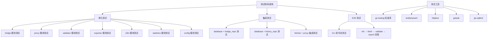

# Tor Bridge Collector 测试改进方案

需求名称：2026-03-31-bridge-collector-testing
更新日期：2026-03-31

## 概述

本方案为 Tor Bridge Collector 项目建立完整的测试体系，涵盖单元测试、集成测试和 E2E 测试三个层次。测试体系将确保各模块功能的正确性和稳定性，达到行业标准 70% 以上的代码覆盖率。

## 架构



## 组件与接口

### 1. 测试框架

| 依赖 | 版本 | 用途 |
|------|------|------|
| testify | v1.8+ | 断言库，提供更友好的断言语法 |
| httptest | 标准库 | HTTP 服务模拟 |
| goleak | v1.4+ | goroutine 泄漏检测 |

### 2. 模块测试设计

#### 2.1 bridge 模块 (pkg/bridge/*)

**测试文件**: `pkg/bridge/bridge_test.go`

| 测试函数 | 测试内容 | 覆盖率目标 |
|----------|----------|------------|
| TestBridge_GenerateHash | hash 生成唯一性 | 100% |
| TestParseBridgeLine_Valid | 有效 bridge line 解析 | 100% |
| TestParseBridgeLine_Invalid | 无效输入处理 | 100% |
| TestParseBridgeLine_Empty | 空行处理 | 100% |
| TestFormatTorrcLine_WithFingerprint | 带指纹的 torrc 格式 | 100% |
| TestFormatTorrcLine_WithoutFingerprint | 不带指纹的 torrc 格式 | 100% |

**关键测试用例**:
```go
func TestParseBridgeLine_Valid(t *testing.T) {
    tests := []struct {
        name     string
        input    string
        expected *Bridge
        wantErr  bool
    }{
        {
            name:  "webtunnel with fingerprint",
            input: "webtunnel 192.168.1.1:443 fingerprint ABCD1234",
            expected: &Bridge{
                Transport:   "webtunnel",
                Address:     "192.168.1.1",
                Port:        443,
                Fingerprint: "ABCD1234",
            },
        },
        {
            name:  "webtunnel without fingerprint",
            input: "webtunnel 10.0.0.1:8080",
            expected: &Bridge{
                Transport: "webtunnel",
                Address:  "10.0.0.1",
                Port:     8080,
            },
        },
    }
}
```

#### 2.2 proxy 模块 (pkg/proxy/*)

**测试文件**: `pkg/proxy/handler_test.go`

| 测试函数 | 测试内容 |
|----------|----------|
| TestParseProxy_Valid | 各种代理格式解析 (http/https/socks5) |
| TestParseProxy_Invalid | 无效代理格式处理 |
| TestProxyHandler_Next | 轮询策略验证 |
| TestProxy_URL | URL 格式生成 |

#### 2.3 validator 模块 (pkg/validator/*)

**测试文件**: `pkg/validator/checker_test.go`

| 测试函数 | 测试内容 |
|----------|----------|
| TestValidator_Validate_Available | 可用 bridge 连接测试 |
| TestValidator_Validate_Unavailable | 不可用 bridge 处理 |
| TestValidator_ValidateConcurrent | 并发验证 |
| TestValidator_ValidateConcurrent_Callback | 回调函数执行验证 |

**Mock 策略**: 使用 `net.DialTimeout` 的 interface 封装，便于在测试中替换

#### 2.4 exporter 模块 (pkg/exporter/*)

**测试文件**: `pkg/exporter/exporter_test.go`

| 测试函数 | 测试内容 |
|----------|----------|
| TestJSONExporter_Export | JSON 导出格式验证 |
| TestTorrcExporter_Export | torrc 导出格式验证 |
| TestAllExporter_Export | 混合导出验证 |
| TestExport_CreatesDirectory | 输出目录自动创建 |
| TestNewExporter | 工厂方法测试 |

**验证方法**: 使用 golden file 测试模式，对比预期输出文件

#### 2.5 i18n 模块 (pkg/i18n/*)

**测试文件**: `pkg/i18n/i18n_test.go`

| 测试函数 | 测试内容 |
|----------|----------|
| TestTranslator_T_ZH | 中文翻译 |
| TestTranslator_T_EN | 英文翻译 |
| TestTranslator_SetLang | 语言切换 |
| TestTranslator_MissingKey | 缺失 key 回退 |

#### 2.6 statistics 模块 (pkg/statistics/*)

**测试文件**: `pkg/statistics/realtime_test.go`

| 测试函数 | 测试内容 |
|----------|----------|
| TestGetRealtimeStats | 实时统计计算 |
| TestRealtimeStats_AvailableRate | 可用率计算 |
| TestGetStatsByPeriod | 历史聚合查询 |

#### 2.7 config 模块 (configs/*)

**测试文件**: `configs/config_test.go`

| 测试函数 | 测试内容 |
|----------|----------|
| TestDefaultConfig | 默认配置生成 |
| TestLoad_Valid | 有效 YAML 加载 |
| TestLoad_NotExist | 文件不存在处理 |
| TestSave | 配置保存 |

### 3. 集成测试设计

**测试文件**: `tests/integration_test.go`

#### 3.1 数据库集成测试

```go
func TestBridgeRepository_Integration(t *testing.T) {
    // 创建临时数据库
    db, err := setupTestDB(t)
    defer db.Close()
    
    repo := NewBridgeRepository(db)
    
    t.Run("Insert and Get", func(t *testing.T) {
        bridge := &Bridge{
            Hash:      "test-hash-123",
            Transport: "webtunnel",
            Address:   "192.168.1.1",
            Port:      443,
        }
        
        id, err := repo.Insert(bridge)
        assert.NoError(t, err)
        assert.Greater(t, id, int64(0))
        
        retrieved, err := repo.GetByHash("test-hash-123")
        assert.NoError(t, err)
        assert.Equal(t, bridge.Address, retrieved.Address)
    })
    
    t.Run("Upsert New", func(t *testing.T) {
        // 测试去重
    })
    
    t.Run("UpdateAvailability", func(t *testing.T) {
        // 测试状态更新
    })
}
```

#### 3.2 Fetcher + Proxy 集成测试

使用 `httptest` 模拟 Tor bridges 服务器:

```go
func TestFetcher_WithProxy_Integration(t *testing.T) {
    // 启动 mock 服务器
    ts := httptest.NewServer(http.HandlerFunc(func(w http.ResponseWriter, r *http.Request) {
        // 返回模拟的 bridges HTML
        html := `<html>Bridge webtunnel 192.168.1.1:443 fingerprint ABCD</html>`
        w.Write([]byte(html))
    }))
    defer ts.Close()
    
    // 使用 127.0.0.1:1080 作为测试代理（实际不会转发）
    fetcher := NewFetcher(ts.URL, 5*time.Second)
    // 此测试主要验证 fetcher 能正确解析响应
}
```

### 4. E2E 测试设计

**测试文件**: `tests/e2e_test.go`

使用 `os/exec` 执行编译后的二进制文件:

```go
func TestE2E_FullWorkflow(t *testing.T) {
    if testing.Short() {
        t.Skip("Skipping E2E tests in short mode")
    }
    
    binPath := buildBinary(t)
    tempDir := t.TempDir()
    
    t.Run("init creates files", func(t *testing.T) {
        cmd := exec.Command(binPath, "init")
        cmd.Dir = tempDir
        output, err := cmd.CombinedOutput()
        assert.NoError(t, err)
        assert.Contains(t, string(output), "初始化成功")
        
        // 验证文件创建
        assert.FileExists(t, filepath.Join(tempDir, "config.yaml"))
    })
    
    t.Run("fetch with proxy", func(t *testing.T) {
        // 使用 --proxy 127.0.0.1:1080 测试 fetch
        // 注意：实际网络测试应该在 CI/CD 环境进行
    })
}
```

## 数据模型

### 测试数据库 Schema

集成测试使用临时 SQLite 数据库，schema 与生产环境一致:

```sql
CREATE TABLE IF NOT EXISTS bridges (
    id INTEGER PRIMARY KEY AUTOINCREMENT,
    hash TEXT NOT NULL UNIQUE,
    transport TEXT NOT NULL DEFAULT 'webtunnel',
    address TEXT NOT NULL,
    port INTEGER NOT NULL,
    fingerprint TEXT,
    discovered_at DATETIME DEFAULT CURRENT_TIMESTAMP,
    last_validated DATETIME,
    is_available INTEGER DEFAULT -1,
    response_time_ms INTEGER,
    created_at DATETIME DEFAULT CURRENT_TIMESTAMP,
    updated_at DATETIME DEFAULT CURRENT_TIMESTAMP
);

CREATE TABLE IF NOT EXISTS validation_history (
    id INTEGER PRIMARY KEY AUTOINCREMENT,
    bridge_id INTEGER NOT NULL,
    validated_at DATETIME DEFAULT CURRENT_TIMESTAMP,
    is_available INTEGER NOT NULL,
    response_time_ms INTEGER,
    error_message TEXT,
    FOREIGN KEY (bridge_id) REFERENCES bridges(id)
);
```

### Golden File 结构

```
tests/golden/
├── exporter/
│   ├── test.json       # JSON 导出预期结果
│   └── test.torrc      # torrc 导出预期结果
```

## 正确性属性

### 单元测试正确性

1. **bridge 模块**
   - `GenerateHash()` 对相同输入产生相同 hash
   - `ParseBridgeLine()` 能正确解析各种格式的 bridge line
   - `FormatTorrcLine()` 输出的格式能被 Tor 客户端识别

2. **proxy 模块**
   - `ParseProxy()` 能正确解析 http/https/socks5 协议
   - `ProxyHandler.Next()` 实现正确的 round-robin 轮询

3. **validator 模块**
   - 超时机制正常工作
   - 并发控制符合 workers 数量限制
   - 回调函数被正确调用

4. **exporter 模块**
   - JSON 输出为有效的 JSON 格式
   - torrc 输出包含所有必需字段
   - 输出目录不存在时自动创建

5. **i18n 模块**
   - 中英文切换正常工作
   - 缺失的 key 返回原始 key

### 集成测试正确性

1. 数据库操作的事务一致性
2. 多线程并发访问数据库的安全性
3. 网络请求和代理设置的正确配合

### E2E 测试正确性

1. CLI 命令行参数解析正确
2. 各子命令按顺序执行能正常工作
3. 错误处理和用户提示信息清晰

## 错误处理

### 测试错误分类

| 错误类型 | 处理策略 | 测试验证方式 |
|----------|----------|--------------|
| 网络超时 | 返回 error | assert.Error + error message 验证 |
| 数据库错误 | 回滚事务 | assert.Error + 错误类型检查 |
| 解析错误 | 跳过该条 | assert.NoError + 日志检查 |
| 文件系统错误 | 返回 error | assert.Error |

### Mock 与 Stub 策略

1. **HTTP 请求**: 使用 `httptest.NewServer` 模拟
2. **数据库**: 创建临时 SQLite 文件，测试后自动清理
3. **网络连接**: 使用 `net.Dialer` 的 Timeout 功能

## 测试策略

### 覆盖率目标

| 模块 | 覆盖率目标 |
|------|------------|
| bridge | 90% |
| proxy | 90% |
| validator | 85% |
| exporter | 85% |
| i18n | 90% |
| statistics | 80% |
| config | 85% |
| database | 75% |
| **整体** | **70%** |

### 测试执行方式

```bash
# 单元测试
go test -v -coverprofile=coverage.out ./pkg/...

# 带覆盖率报告
go test -coverprofile=coverage.out ./...
go tool cover -html=coverage.out -o coverage.html

# 跳过慢速测试
go test -short ./...

# E2E 测试（需要编译二进制）
go test -v -tags=e2e ./tests/...

# 检查 goroutine 泄漏
go test -v -race ./pkg/...  # 使用 -race 检测竞态条件
```

### CI/CD 集成

```yaml
# .github/workflows/test.yml (示例)
test:
  runs-on: ubuntu-latest
  steps:
    - uses: actions/checkout@v4
    - uses: actions/setup-go@v5
      with:
        go-version: '1.21'
    - name: Run unit tests
      run: go test -v -coverprofile=coverage.out -race ./...
    - name: Run E2E tests
      run: go test -v -tags=e2e ./tests/...
    - name: Upload coverage
      uses: codecov/codecov-action@v3
```

## 项目结构

```
tor-bridge-collector/
├── pkg/
│   ├── bridge/
│   │   ├── bridge_test.go          # 单元测试
│   │   └── fetcher_test.go         # fetcher 单元测试
│   ├── proxy/
│   │   └── handler_test.go        # proxy 单元测试
│   ├── validator/
│   │   └── checker_test.go        # validator 单元测试
│   ├── exporter/
│   │   └── exporter_test.go       # exporter 单元测试
│   ├── i18n/
│   │   └── i18n_test.go           # i18n 单元测试
│   ├── statistics/
│   │   └── realtime_test.go      # statistics 单元测试
│   └── database/
│       └── bridge_repo_test.go    # database 单元测试
├── configs/
│   └── config_test.go             # config 单元测试
├── tests/
│   ├── integration_test.go        # 集成测试
│   ├── e2e_test.go                 # E2E 测试
│   └── golden/                    # Golden file 测试数据
│       ├── exporter/
│       │   ├── valid.json
│       │   └── valid.torrc
├── go.mod
├── go.sum
└── README.md
```

## go.mod 依赖

```go
require (
    github.com/mattn/go-sqlite3 v1.14.18
    github.com/stretchr/testify v1.8.4      // 新增: 断言库
    github.com/urfave/cli/v2 v2.27.1
    go.uber.org/goleak v1.4.0               // 新增: goroutine 泄漏检测
    gopkg.in/yaml.v3 v3.0.1
)
```

## 实施步骤

1. **Phase 1: 基础设施** (预计 1 天)
   - 添加测试依赖到 go.mod
   - 创建 tests 目录结构
   - 实现 test helpers (临时数据库创建等)

2. **Phase 2: 单元测试** (预计 2-3 天)
   - 为每个 pkg 模块编写单元测试
   - 确保达到覆盖率目标
   - 使用 golden file 验证导出格式

3. **Phase 3: 集成测试** (预计 1 天)
   - 实现数据库集成测试
   - 实现 fetcher + proxy 集成测试

4. **Phase 4: E2E 测试** (预计 1 天)
   - 实现 CLI 命令 E2E 测试
   - 实现完整工作流测试

5. **Phase 5: CI/CD 集成** (预计 0.5 天)
   - 配置 GitHub Actions
   - 添加覆盖率报告

## 注意事项

1. **网络测试**: 实际网络请求测试（如 fetch 到真实 Tor 服务器）使用 `127.0.0.1:1080` 代理
2. **测试隔离**: 每个测试使用独立的临时数据库文件
3. **并行测试**: 使用 `t.Parallel()` 提高测试执行速度
4. **资源清理**: 使用 `t.Cleanup()` 确保资源正确释放
